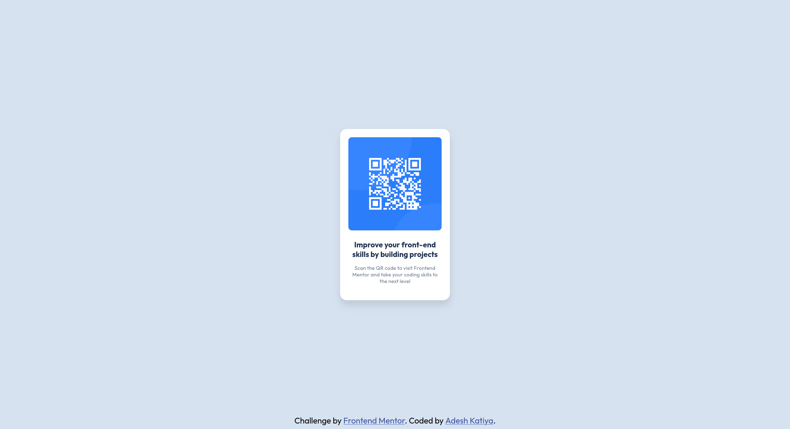

# Frontend Mentor - QR code component solution

This is a solution to the [QR code component challenge on Frontend Mentor](https://www.frontendmentor.io/challenges/qr-code-component-iux_sIO_H). Frontend Mentor challenges help you improve your coding skills by building realistic projects. 

## Table of contents

- [Overview](#overview)
  - [Screenshot](#screenshot)
  - [Links](#links)
- [My process](#my-process)
  - [Built with](#built-with)
  - [What I learned](#what-i-learned)
  - [Useful resources](#useful-resources)

## Overview

### Screenshot

### Links

- Solution URL: [Add solution URL here](https://your-solution-url.com)
- Live Site URL: [QR Code component](https://fem-qr-code-component-main-chi.vercel.app/)

## My process

### Built with

- Semantic HTML5 markup
- CSS custom properties

### What I learned

- I tried to use relative units such as `rem` instead of fixed units like `px` in my css.
- Also tried to modularize my code for different purposes. Although it's a small project challenge, it has made me familiar with the use of css modules. 

### Useful resources

- [Google](https://www.google.com)
- [BEM](https://www.example.com) - For bem naming conventions.

